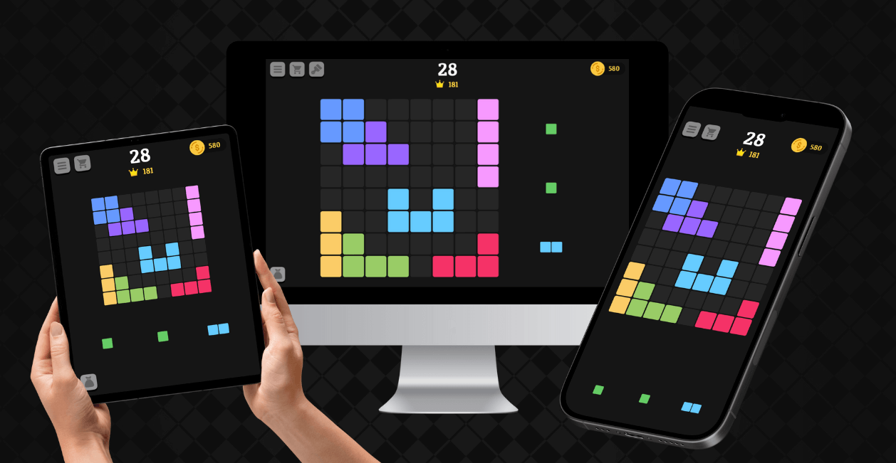
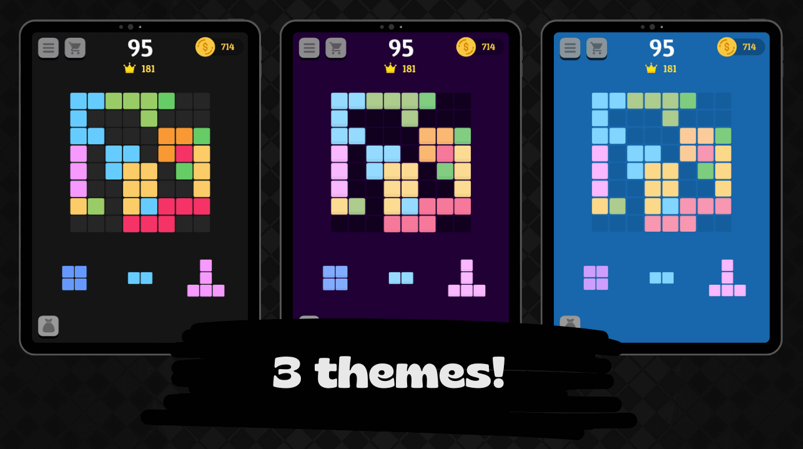
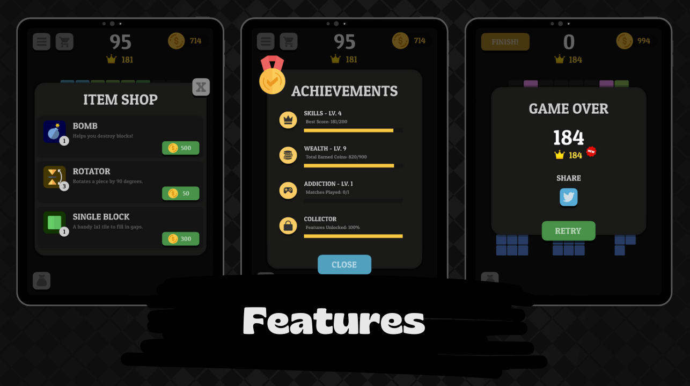

# [ Fill the Square](https://ryanbalieiro.github.io/fill-the-square/) by Ryan Balieiro

A fully responsive, open-source canvas game built with JavaScript and powered by the Cocos2D-JS framework. It's lightweight, adjusts to any screen size, and features intuitive gameplay, making it easy to pick up and enjoy.

## [Live Preview](https://ryanbalieiro.github.io/fill-the-square/)

Check out the live version of the game deployed **[here](https://ryanbalieiro.github.io/fill-the-square/)** on GitHub Pages.

### Runtime Requirements

- iOS 9.0+ for iPhone / iPad.
- Android 4.6.0+ for Android.
- OS X v10.9+.
- Windows 7+.

## Status

## About

This game was created and is maintained by **[Ryan Balieiro](https://ryanbalieiro.com/)**. It's designed to run on web browsers and  is based on the open-soruce [Cocos2D](https://github.com/cocos2d/cocos2d-x) framework.

### Project Architecture

The project architecture consists of two main modules:

- **Core Module**: This is a collection of reusable features that can be used in multiple games. It includes things like generic menus, item shops, session management, API connections, loaders, achievements, leaderboards, feedback animations, and more.

- **FillTheSquare Module**: This contains the specific game features

The game uses the **MVP (Model-View-Presenter)** architecture. Each module is organized into the following groups:

- **APIs**: These manage OS-related tasks, like accessing the native viewport.
- **Helpers**: A collection of utility functions that can be used across different parts of the project.
- **Loaders**: Responsible for loading and unloading game resources.
- **Managers**: Handle things like data synchronization and session management.
- **Models**: Represents the game's data and business logic.
- **Views**: Interface components that make up the presentation layer.
- **GameDelegate.js**: Serves as the central presenter, acting as a bridge between the model and the view.

## Screenshots

## Copyright and License

Code released under the [MIT](https://github.com/StartBootstrap/startbootstrap-agency/blob/master/LICENSE) license.
