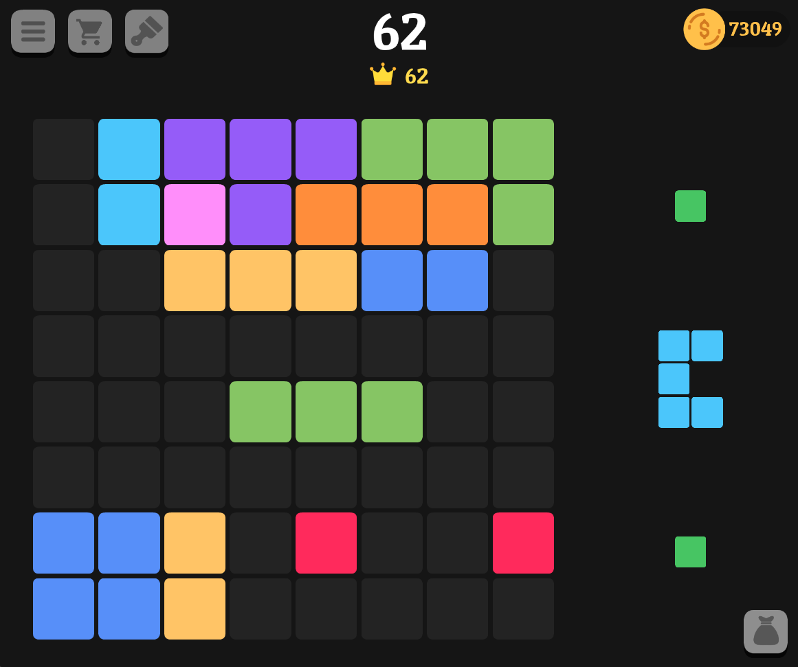

# Fill The Square

A fully responsive open-source canvas game developed on Javascript, and powered by the Cocos2D-JS framework. It boasts a lightweight design, adjusts to any screen size and features an intuitive gameplay, making it super easy to learn and play.

## Preview

**[Play Live Preview](https://ryanbalieiro.github.io/fill-the-square/)**

## Status

## About

This game was created and is maintained by **[Ryan Balieiro](https://ryanbalieiro.com/)**. It's designed to run on web browsers and  is based on the open-soruce [Cocos2D](https://github.com/cocos2d/cocos2d-x) framework.

### Project Architecture

The project architecture consists of two main modules:

- **Core Module**: comprises a collection of versatile implementations intended for use in multiple games, encompassing generic implementations of menus, item shops, session management logic, API bridges, loaders, achievements, leaderboards, feedback animations, and more.

- **FillTheSquare Module**: contains the specific implementation of the game features.

The game follows the **MVP (Model-View-Presenter)** architecture. Within each module, the following package groups can be found:

- **APIs**: These handle OS-related functionalities, providing access to features such as the native viewport.
- **Helpers**: A set of utilities and auxiliary functions that can be accessed by multiple components within the architecture.
- **Loaders**: Classes that are responsible for loading and unloading game resources.
- **Managers**: Classes that handle tasks such as data synchronization and session management.
- **Models**: The package that represents the game's data and business logic.
- **Views**: The presentation layer consisting of user interface components.
- **GameDelegate.js**: Acts as a centralized presenter, serving as an intermediary between the model and the view.

### Runtime Requirements

- iOS 8.0+ for iPhone / iPad.
- Android 3.0.0+ for Android.
- OS X v10.9+.
- Windows 7+.

## Copyright and License

Code released under the [MIT](https://github.com/StartBootstrap/startbootstrap-agency/blob/master/LICENSE) license.